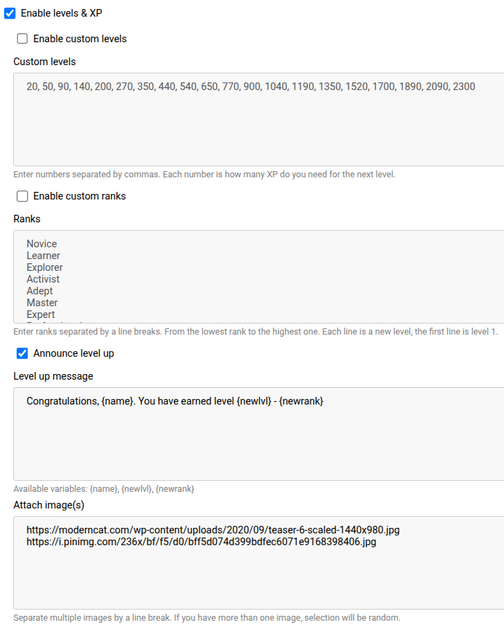

## Project overview

A configurable Telegram bot that allows creating a hierarchy of users within a group.

Each active user has a rank and an amount of experience they have already gained.
Users can earn XP every time they send a message of any type to the group.
When their XP reaches the maximum value (predefined in the web-config), they are promoted to the next rank.

Users can view their statistics for every group where the bot is present by using the ***/chatlist*** command in a private chat with the bot.
Additionally, if any group member sends the ***/stats*** command in a group chat, the statistics for that group will be displayed in the chat.

You can host this bot yourself or add someone's pre-configured instance to your group. Here is an example of a configured bot: [@CustomRankUpBot](https://t.me/CustomRankUpBot).

## Usage guide

Getting started with this bot is easy! Just follow these steps:

1. **(If you are admin)** Open the web-config and set up the bot according to your preferences.
2. Find this bot to learn more about bot's features.
3. Add the bot to the group and promote it to an admin role.

## Web-config

The web-config is a web form that allows you to configure the bot in detail.
**Note: Each bot has a single configuration, that can only be modified by an admin.**
Although the bot can be used in hundreds of groups, any changes made to the configuration by admin will apply to all chats.




The web configuration allows you to customize the following settings:

- The number of levels and rank names associated with each level.
- The amount of experience required to reach the next level.
- The message sent by the bot when a user levels up.

### Additional Web-Config Features

- There are already default ranks and levels you can freely use.
- If you like the rank names but find the XP requirements too high or low, you can adjust them by clicking the "Enable custom levels" toggle. If there are fewer levels than default ranks, additional ranks will be removed, and the bot will use only the levels you specify.
- To stop the bot from tracking user experience, click the "Enable Levels & XP" toggle.
- The level-up announcement message supports variables to make it more personalized. For example, ***{name}*** will be replaced with the user's Telegram first name.
- You can attach an image to the level-up announcement message.
- If multiple images are specified, one will be selected randomly.
- To disable the level-up announcement message, click "Announce Level Up."

## Requirements

This bot was developed in Java using the Spring Boot framework. Below is the list of major requirements to run the application:

1. Java 17+
2. Spring Boot 3.3.0
3. Maven
4. PostgreSQL
5. Telegram Bot API key

## Installation guide

Clone the repo to your device 
```
git clone https://github.com/vladpochuev/rank-up-bot.git
```

Run the database.sql script. **Note: It includes a script that adds default ranks.**

```
psql
\i database.sql
```

Create application.yml file inside the src/main/resources directory. It should look like this:

```
logging:
  pattern:
    console: "%clr(%d{${LOG_DATEFORMAT_PATTERN:yyyy-MM-dd'T'HH:mm:ss.SSSXXX}}){faint} %clr(${LOG_LEVEL_PATTERN:%5p}) %clr(${PID:- }){magenta} %clr(---){faint} %clr(${LOG_CORRELATION_PATTERN:}){faint} [%clr(%10marker){magenta }] %clr(%-40.40logger{39}){cyan} %clr(:){faint} %m%n${LOG_EXCEPTION_CONVERSION_WORD:%wEx}}"
spring:
  jpa:
    hibernate:
      ddl-auto: update
    show-sql: false
  application:
    name: rank_up
  datasource:
    url: "" # Full database URL
    username: "" # Database username
    password: "" # Database password
    driver-class-name: org.postgresql.Driver
bot:
  name: "" # Bot's Telegram username
  token: "" # Bot's Telegram API token
server:
  http2:
    enabled: true
  port: 8080
rank-up-config:
  path: "src/main/resources/rankUpConfig.ser"
```

Run the code via IntelliJ IDEA or Maven in the main directory:

```
mvn spring-boot:run
```

Or, if you already have a .jar file:
```
java -jar -Drank-up-config.path="~/rankUpConfig.ser" rank-up-bot.jar
```
**Note: If you want to run the .jar file, you need to specify the path to the directory where the config file will be created.**

If everything is set up correctly, the Telegram bot will work properly and the web-config will be available at http://localhost:8080.